Codes/QLoRa — 模块化说明与运行指南

此文档基于仓库中 `Codes/QLoRa` 的实际代码实现与最近一次实验产物（见 `Codes/outputs/run_001`）撰写，目标是提供一个清晰的模块说明、可复现的运行步骤与本次实验（run_001）的关键结果汇总。

更新时间：2025-10-29

# Codes/QLoRa — 模块化技术文档（完整版）

**更新日期**：2025-10-29

本文档基于 `Codes/QLoRa` 源码与真实实验产物（见 `Codes/outputs/run_001` / `Codes/QLoRa/outputs/full_run_002`），目标是把模块说明、QLoRA 算法细节、训练策略、超参建议、评估流程与可视化完全整合，形成一份可直接交付的技术文档与复现指南，并附带 Mermaid 流程图源文件以生成漂亮流程图。

---

## 一句话概述

QLoRa 实现了一个面向礼貌-不文明（civility-uncivility）分类的端到端流水线：

数据加载 → 文本清洗/切分 → 嵌入生成（Qwen3-based / instruction）→ 可选 QLoRA（LoRA + 4-bit quantization）微调或基于嵌入的分类器训练 → 验证/测试评估 → 报告与可视化。

## 目录（模块级别）

- `config.py`：实验配置类（DataConfig, ModelConfig, TrainingConfig, EvaluationConfig），包含默认配置函数、JSON 保存/加载接口。
- `data_processor.py`：数据加载、清洗、去重、类平衡、train/val/test 划分、统计汇总与快速抽样工具（用于 quick-test）。
- `enhanced_models.py`：嵌入器与模型管理器：
  - `EnhancedQwenEmbedder`：支持 instruction prompt、batch encode、embedding 缓存、bitsandbytes 量化加载（4-bit）、LoRA adapter 应用（PEFT）。
  - `EnhancedModelManager`：训练 loop、阈值搜索、模型保存/加载、ensemble 支持。
- `evaluation.py`：指标计算（accuracy/f1/precision/recall/ROC-AUC/PR-AUC/ECE）、混淆矩阵、分层评估与 error analysis。
- `enhanced_visualizer.py`：静态图（Matplotlib/Seaborn）与交互式（Plotly）报告以及 HTML dashboard 生成。
- `main.py`：CLI 和实验编排，自动化创建 `run_XXX` 目录，保存 `config.json`，并在完成后生成 `experiment_report.md`。

## 算法与实现细节（QLoRA / LoRA / 量化）

### QLoRA（quick LoRA）概念

- QLoRA 是把 LoRA 与低位量化（例如 4-bit）结合的技术路径：把大型模型以低精度（4-bit）加载（通过 bitsandbytes），在此基础上仅训练 LoRA 适配器（少量参数）来微调模型，从而大幅降低显存占用并保持性能。

- 优点：显存占用显著减少，可在单卡或小显存多卡上进行微调；训练速度与成本降低，适合工程化部署与快速试验。

### 本项目实现要点

- 量化加载：优先采用 bitsandbytes 的 4-bit 加载（`bnb.4bit`），当设备或环境不支持时自动回退到 8-bit 或 FP32；代码实现了 try/except 回退路径以保证鲁棒性。
- LoRA（PEFT）：使用 PEFT/LoRA adapter，只微调 adapter 的低秩矩阵 A/B（参数 r、alpha、dropout 可配置），基础模型保持冻结以节省显存。
- 训练流程：通过 `EnhancedQwenEmbedder.encode()` 批量生成并缓存嵌入（npz），分类器训练可直接基于这些嵌入（Logistic/XGBoost/MLP），亦可选择在 LoRA 上做端到端微调。
- 梯度累积与混合精度：在低显存下默认启用 gradient_accumulation（accumulate_steps>1）以及 AMP（混合精度）来减少显存消耗。

### 关键实现细节（代码映射）

- 量化加载：`enhanced_models.py` 中 embedder 初始化会尝试使用 `transformers` + `bnb` 进行 4-bit 加载，并在异常时回退到更保守的加载方式。
- LoRA 持久化：LoRA adapter 被单独保存到 `models/<dataset>/lora_adapter/`，便于推理时与 base model 组合恢复。

## 训练策略与工程化细节

设计目标：在资源受限环境（单卡 8–12GB）下尽量复现接近 full-precision 性能，并且保证可重复、可审计的训练记录。

### 数据与采样

- 对每个数据集执行去重与最小清洗（移除空、超短文本，可选的 normalize/normalize punctuation）。
- 若数据类别不平衡，支持过采样（upsample minority）或 class-balanced sampler（通过配置启用）。
- 支持 `max_samples` 配置以便做 quick-test 或参数扫描。

2) 嵌入策略：
  - 默认：Instruction-based mean pooling（model.encode(texts, instruction=... ) → mean pooling → L2 归一化）
  - 可选：SetFit-style contrastive fine-tuning（配置 `use_contrastive=true`）以提升嵌入辨别能力

3) 模型训练（两条路径）：
  A. 基于嵌入的经典分类器（推荐用于大规模 / 低成本场景）
    - 特点：训练快，容易调参，适合 ensemble。常用算法：LogisticRegression（baseline）、XGBoost（更强）、SVM（小样本有效）。
    - 优化：使用 sklearn pipeline（StandardScaler → classifier），对 class_weight 及 threshold 进行验证集调优。

  B. QLoRA 端到端微调（推荐用于要最大化性能的场景）
    - 流程：量化加载 base model → 挂载 LoRA adapter → 在任务数据上微调 adapter（只训练 adapter 参数）→ 保存 adapter。
    - 优化技巧：小 learning rate（1e-4 ~ 5e-5），权重衰减小，使用 warmup steps + cosine decay 学习率策略，batch_size 较小但用 gradient_accumulation。

4) Early stopping 与 checkpoint：
  - 监控指标：验证集 F1（或 ROC_AUC），连续若干 step 无改善（patience）则早停。
  - Checkpoint：按最优验证指标保存 adapter + 最后模型快照。

5) 超参数建议（起点）

 - 嵌入 batch_size: 32（GPU） / 8（CPU）
 - QLoRA batch_size: 4–16（视显存）
 - learning_rate (LoRA): 5e-5 – 1e-4
 - lora_r: 4–32（资源允许时更大）
 - lora_alpha: 32–128
 - quantize: 4bit（优先）
 - gradient_accumulation_steps: 1–8（根据 batch 大小调节）
 - epochs: 3–10（监控 validation）

## Loss 与评价准则

- 微调（LoRA）通常使用二分类交叉熵损失（BCEWithLogits）。当样本不均衡时，使用 pos_weight 或 focal loss（可选）。
- 验证时优先关注 validation F1（对 class 不平衡鲁棒）及 ROC_AUC（概率质量）。

## 训练流程图（已渲染）

下面为已渲染的训练与数据流图（SVG），源文件位于 `Codes/QLoRa/diagrams/`：

训练主流程：

数据流（从原始文件到最终 artifact）：

## 评估、可视化与报告
png
- 每个数据集会生成 `evaluation_results.json`、`evaluation_summary.md`、`predictions.csv`、以及若干图像（confusion_matrix.png、roc_curve.png、precision_recall.png）。
- 最终会合并成 `experiment_report.md`，其中包含 per-dataset 指标表和 artifact 路径（参见 `Codes/outputs/run_001/experiment_report.md`）。

## 实验结果示例（摘自 run_001）

- total samples: 29,590（Train: 20,709；Val: 2,961；Test: 5,920）
- per-dataset test ROC_AUC（示例）： chnsenticorp=0.9363, go_emotions=0.9353, civil_comments=0.9187, wikipedia_politeness=0.8012, toxigen=0.8434

完整数值请参阅： `Codes/outputs/run_001/experiment_report.md`

## CI/可重复性建议

- 把 `config.json`（每次运行会保存）与 `experiment_report.md` 一并存档。若需要复现，先使用相同的 `config.json` 并确保数据快照一致。
- 建议在 CI 中加入 `quick-test`（小样本）任务以保证代码路径可执行。

## 文件/产物一览（简要）

- `config.json` — 保存每次实验配置
- `experiment.log` — 详细日志
- `experiment_report.md` — 人类可读报告
- `*/embeddings/*.npz` — 嵌入缓存
- `*/models/*` — 分类器模型、LoRA adapter
- `*/validation/*` 和 `*/test/*` — 评估产物

---
